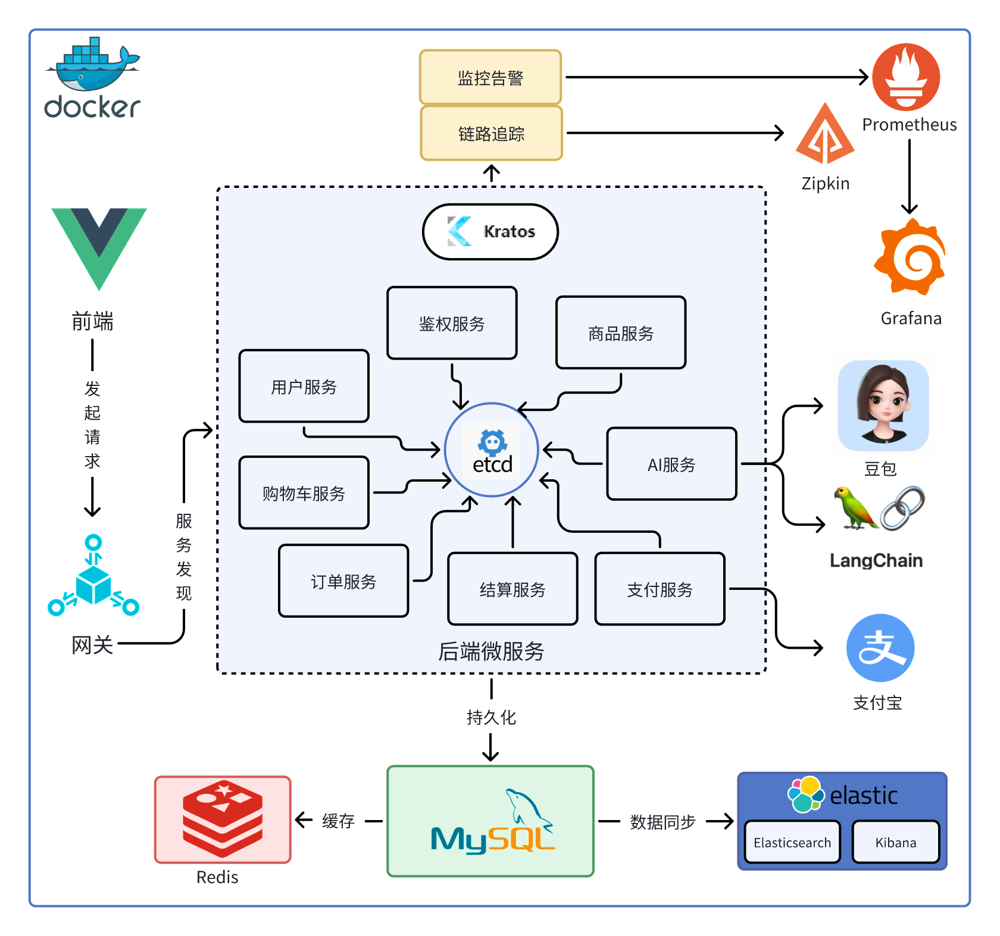
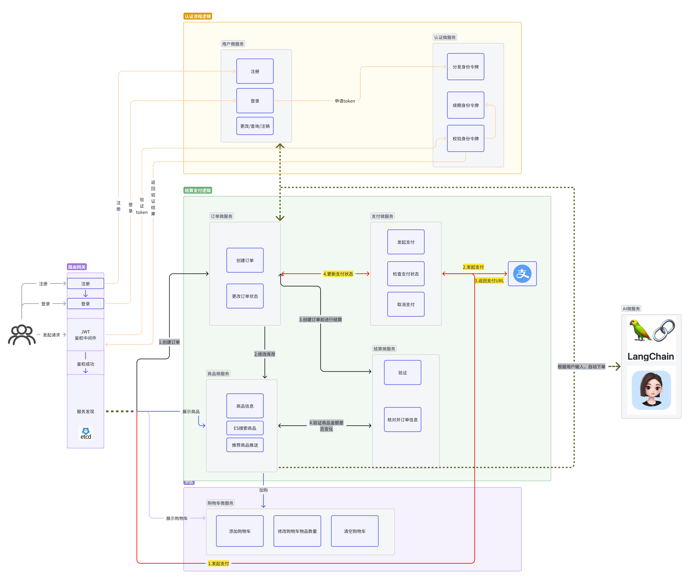

# E_commerce
go语言开发的抖音电商

## ✨ 技术选型

- 🔐 **微服务** - Kratos、etcd
- 📦 **数据库** - Gorm、MySQL
- 🛒 **Web框架** - Gin
- 📋 **搜索引擎** - Elasticsearch、Kibana
- 💳 **缓存** - Redis
- 🏗️ **中间件** - JWT、Zipkin
- 📝 **监控与可视化** - Prometheus、Grafana
- ⚙️ **AI Agent 框架** - LangChain
- ⚙️ **容器化部署** - Docker基于YAML的配置管理




服务之间的逻辑关系：




## 🚀 快速开始

### 前置要求
> 在开始之前，确保您已安装以下内容：
> - docker
> - docker-compose

### 安装说明


#### 一键部署

```bash
git clone https://github.com/M2883b0/E_commerce # 下载项目
# 配置大模型参数
cat > E_commerce/AI_service/.env <<EOF
ARK_API_KEY=your_key # api key
ARK_BASE_URL=your_base_url # 模型地址
MODEL_NAME=doubao-1-5-pro-32k-250115 # 模型名称
EOF
# 运行一键部署脚本
./one-click_deployment.sh
```

#### 如果需要单独部署每个服务

```bash
git clone https://github.com/M2883b0/E_commerce # 下载项目
cd Order_service # 进入你想要进去的微服务目录
docker-compose up -d # 一键启动即可
```

可以修改docker-compose.yml文件来修改端口号和镜像地址，一些依赖的服务（etcd等）也可以通过项目根目录的docker-compose.yml来一键部署。
